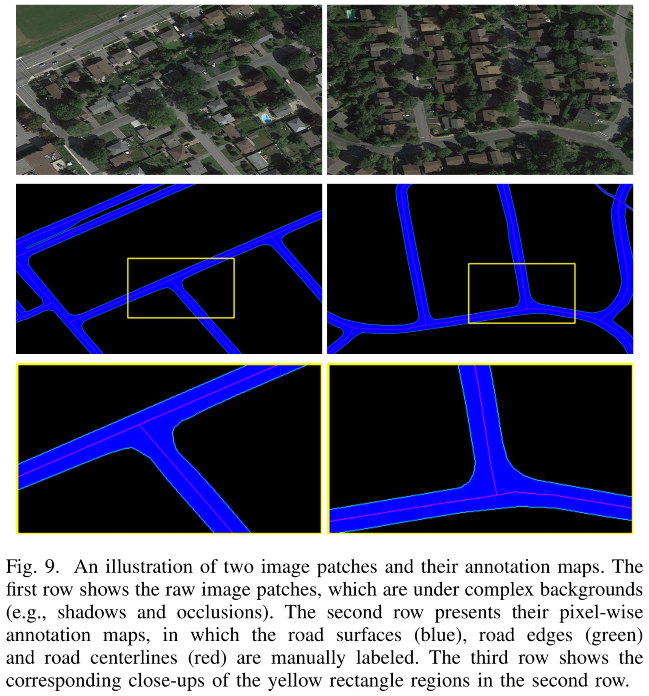

# RoadNet

## 1.Code


 - Python 2.7. Python 2.7 is supported until it retires in 2020.
 - Python bindings for OpenCV. (Optional, but required by a lot of features)
 - TensorFlow ≥ 1.0,

[More Details >>>](./codes/README.md)

## 2.Dataset

Benchmakr Dataset for the paper: [RoadNet: Learning to Comprehensively Analyze Road Networks in Complex Urban Scenes from High-Resolution Remotely Sensed Images](https://ieeexplore.ieee.org/document/8506600), IEEE Transactions on Geoscience and Remote Sensing (TGRS), 2018.



---------

We collected several typical urban areas of Ottawa, Canada from [Google Earth](http://earth.google.com). The images are with 0.21m spatial resolution per pixel (zoom level 19).

### 2.1.Download

Download link: 

 - [BaiduYun](https://pan.baidu.com/s/1l9RZvyYfLgTOx_k4LQRyhQ)（Password: h2zt）
 - [GoogleDrive](https://drive.google.com/open?id=1GDHy7uwgOswuCDC49OamlNkAxjaITPBI)

### 2.2.Training and Testing

Training files:

 - 2,3,4,5,6,7,8,9,10,11,12,13,14,15

Testing files:

 - 1,16,17,18,19,20

### 2.3.Annotations

We take an example with the folder "1": 

|Filename|Explaination|
|:----:|:----|
|`Ottawa-1.tif`|original image|
|`segmentation.png`|manual annotaion of road surface|
|`edge.png`|manual annotation of road edge|
|`centerline.png`|manual annotation of road centerline|
|`extra.png`|roughly mark the heterogeneous regions with a single pixel width brush (red)|
|`extra-Ottawa-1.tif`| the `Ottawa-1.tif` is overlaid with the `extra.png`|

### 3.Citation

Please cite this paper if you use this dataset:

```
@article{liu2018roadnet,
  title={RoadNet: Learning to Comprehensively Analyze Road Networks in Complex Urban Scenes from High-Resolution Remotely Sensed Images},
  author={Liu, Yahui and Yao, Jian and Lu, Xiaohu and Xia, Menghan and Wang, Xingbo and Liu, Yuan},
  journal={IEEE Transactions on Geoscience and Remote Sensing},
  volume={57},
  number={4},
  pages={2043--2056},
  year={2018},
  doi={10.1109/TGRS.2018.2870871}
}
```

You are also welcomed to contact me: yahui.cvrs@gmail.com
