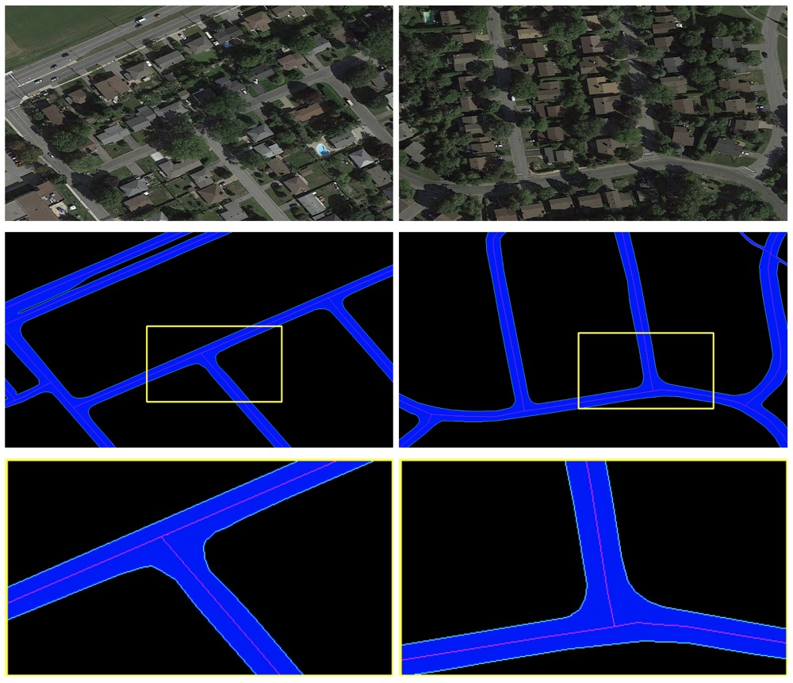
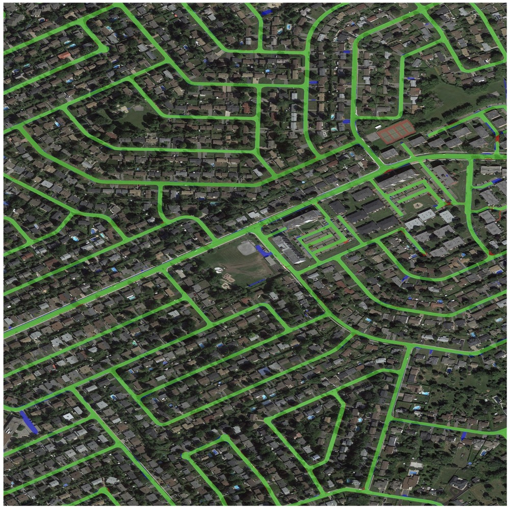

# RoadNet

A multi-task benchmark dataset for the paper: [RoadNet: Learning to Comprehensively Analyze Road Networks in Complex Urban Scenes from High-Resolution Remotely Sensed Images](https://ieeexplore.ieee.org/document/8506600), IEEE Transactions on Geoscience and Remote Sensing (TGRS, IF: 5.63), 2019. [[paper]](./RoadNet-TGRS-2019.pdf) | [[code]](https://github.com/yhlleo/DeepSegmentor) | [[dataset]](https://github.com/yhlleo/RoadNet)


## 1.Dataset



---------

We collected several typical urban areas of Ottawa, Canada from [Google Earth](http://earth.google.com). The images are with 0.21m spatial resolution per pixel (zoom level 19). 

**Please note that we do not own the copyrights to these original satellite images. Their use is RESTRICTED to non-commercial research and educational purposes.**

### 1.1.Download

Download link: 

 - [BaiduYun](https://pan.baidu.com/s/1l9RZvyYfLgTOx_k4LQRyhQ)（Password: h2zt）
 - [GoogleDrive](https://drive.google.com/open?id=1GDHy7uwgOswuCDC49OamlNkAxjaITPBI)

### 1.2.Training and Testing

Training files:

 - 2,3,4,5,6,7,8,9,10,11,12,13,14,15

Testing files:

 - 1,16,17,18,19,20

### 1.3.Annotations

We take an example with the folder "1": 

|Filename|Explaination|
|:----:|:----|
|`Ottawa-1.tif`|original image|
|`segmentation.png`|manual annotaion of road surface|
|`edge.png`|manual annotation of road edge|
|`centerline.png`|manual annotation of road centerline|
|`extra.png`|roughly mark the heterogeneous regions with a single pixel width brush (red)|
|`extra-Ottawa-1.tif`| the `Ottawa-1.tif` is overlaid with the `extra.png`|

## 2.Visualization of Results




## 3.Reference

Please cite this paper if you use this dataset:

```
@article{liu2019roadnet,
  title={RoadNet: Learning to Comprehensively Analyze Road Networks in Complex Urban Scenes from High-Resolution Remotely Sensed Images},
  author={Liu, Yahui and Yao, Jian and Lu, Xiaohu and Xia, Menghan and Wang, Xingbo and Liu, Yuan},
  journal={IEEE Transactions on Geoscience and Remote Sensing},
  volume={57},
  number={4},
  pages={2043--2056},
  year={2019},
  doi={10.1109/TGRS.2018.2870871}
}
```

If you have any questions, please contact me: yahui.liu AT unitn.it without hesitation.
